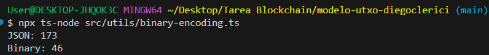

# Documentación - Modelo UTXO

## Enfoque de Implementación
### Tarea 1
Decidí hacer las verificaciones por separado para mantener un orden y que se vea un código más limpio, sin priorizar tanto la eficiencia.
1. **Validación de Existencia de UTXO**
   - Itero sobre todos los inputs, para cada uno obtengo su UTXO, si es null (no existe) lanza el error adecuado.
2. **Validación de Balance**
   - Verifico que la suma de los montos de outputs sea igual a la suma de los montos de los UTXO obtenidos con inputs.
    

3. **Validación de Firmas Criptográficas**
   - Creo datos de transacción con la función `createTransactionDataForSigning_` dada.
   - Para cada input de la transacción verifico la firma con `verify` de `'./utils/crypto'`.

4. **Prevención de Doble Gasto**
   - Recorro los inputs, si el UTXO no esta en el conjunto lo agrego, si ya está en el conjunto, significa que hay duplicados (también se puede hacer con un doble for).

5. **Validación de Edge Cases**
   - Para cada output de la transacción se verifica que su monto sea positivo (Por error en la prueba, lanzo error de cantidad negativa incluso si es 0).

### Tarea 2
Para esta parte de la tarea usé los métodos de la clase Buffer que me permiten codificar y decodificar datos de una forma específica. Primero creé funciones auxiliares para escribir en un buffer cada dato de la manera en que es sugerida, luego lo mismo para decodificar, con la diferencia de que estas también deben devolver la posición en la que terminaron para poder seguir decodificando.

Para codificar los datos de manera que luego se tenga la información necesaria para decodificar, como es sugerido, a los datos con largos variables se indica su largo como prefijo y para el resto se codifican en un tamaño fijo. También escribo la cantidad de entradas y salidas, ya que voy a necesitar saber esa cantidad para poder recorrerlas en la decodificación.

Para decodificar, uso las funciones auxiliares de lectura de buffer y voy decodificando en el orden que se había codificado, siempre manteniendo la posición del buffer que estoy leyendo para decodificar el siguiente dato. Finalmente con todos los datos se crea la transacción y se devuelve.

Para confirmar el aumento en eficiencia hago una pequeña prueba comparando el tamaño de una transacción en JSON y la misma transacción usando la función hecha para codificar. 

Resultado de prueba:
 

## Desafíos
Para la Tarea 1, sobre todo al principio me costó entender el contexto de la función, todo el entorno y las funciones disponibles que tenía, pero la que encontré más difícil fue la Tarea 2, ya que no estoy muy familizarizado con el tema en sentido de código, por lo tanto no conocía las funciones de librería para codificar y decodificar.

### Uso de Herramientas de Asistencia
- Sugerencias de Copilot de manera selectiva, principalmente en la Tarea 2.